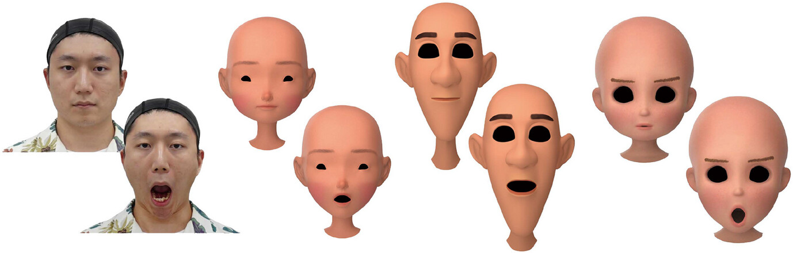
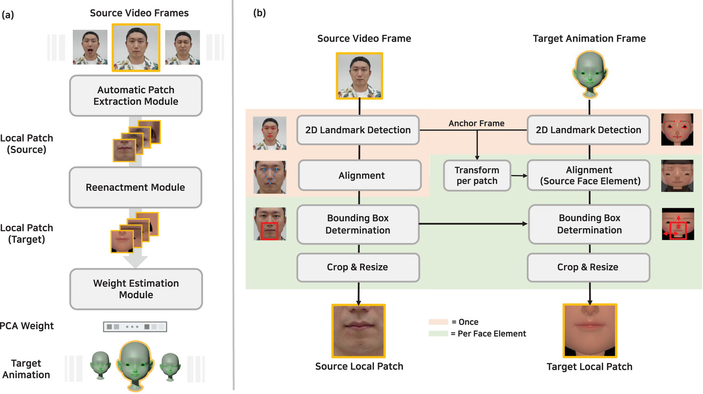

# [Eurographics 2025] Deep-Learning-Based Facial Retargeting Using Local Patches



## Overview
### inference
Overview of the proposed method at inference time (a) and the illustration of automatic patch extraction (b) using local patch extraction around the lips as an example.


## :mailbox_with_mail: Contact

- **Inyup Lee**: [leeinyup123@kaist.ac.kr](mailto:leeinyup123@kaist.ac.kr)

## :mega: Citation
```bibtex
@article{https://doi.org/10.1111/cgf.15263,
author = {Choi, Yeonsoo and Lee, Inyup and Cha, Sihun and Kim, Seonghyeon and Jung, Sunjin and Noh, Junyong},
title = {Deep-Learning-Based Facial Retargeting Using Local Patches},
journal = {Computer Graphics Forum},
volume = {44},
number = {1},
pages = {e15263},
keywords = {animation, facial animation, motion capture, motion transfer, image and video processing},
doi = {https://doi.org/10.1111/cgf.15263},
url = {https://onlinelibrary.wiley.com/doi/abs/10.1111/cgf.15263},
eprint = {https://onlinelibrary.wiley.com/doi/pdf/10.1111/cgf.15263},
abstract = {Abstract In the era of digital animation, the quest to produce lifelike facial animations for virtual characters has led to the development of various retargeting methods. While the retargeting facial motion between models of similar shapes has been very successful, challenges arise when the retargeting is performed on stylized or exaggerated 3D characters that deviate significantly from human facial structures. In this scenario, it is important to consider the target character's facial structure and possible range of motion to preserve the semantics assumed by the original facial motions after the retargeting. To achieve this, we propose a local patch-based retargeting method that transfers facial animations captured in a source performance video to a target stylized 3D character. Our method consists of three modules. The Automatic Patch Extraction Module extracts local patches from the source video frame. These patches are processed through the Reenactment Module to generate correspondingly re-enacted target local patches. The Weight Estimation Module calculates the animation parameters for the target character at every frame for the creation of a complete facial animation sequence. Extensive experiments demonstrate that our method can successfully transfer the semantic meaning of source facial expressions to stylized characters with considerable variations in facial feature proportion.},
year = {2025}
}
```
